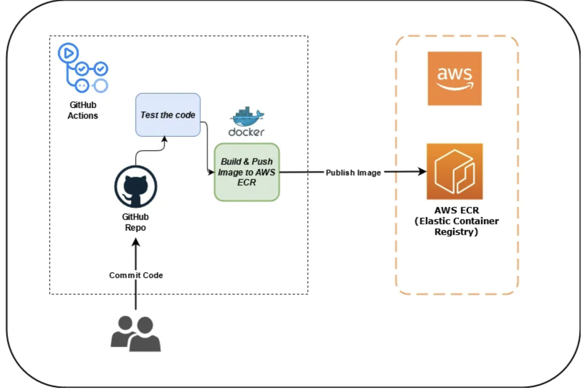
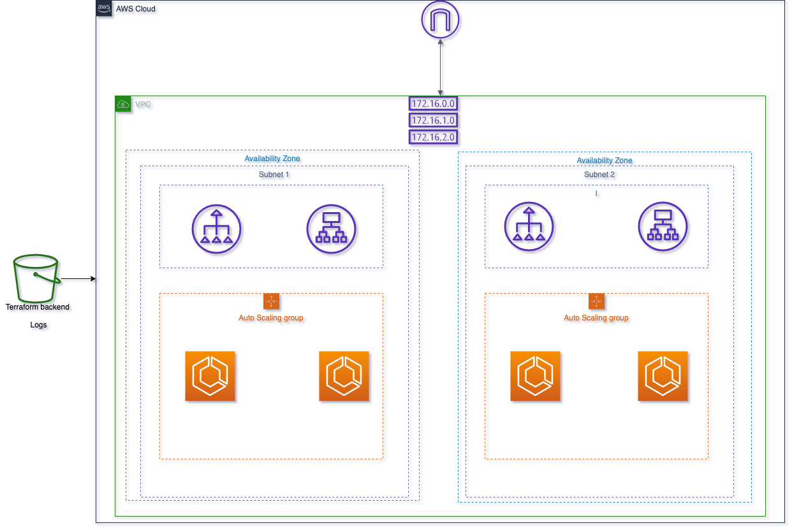

# mews-snooze

Application deployed on AWS ECS Infrastructure

## Directory Structure

MEWS-SNOOZE/
├── .github/
│   └── workflows/
├── application/
│   ├── public/
│   └── src/
├── core-infra/
│   └── container-definitions/
├── deploy-infra/
│   ├── dev/
│   ├── prod/
│   └── staging/
├── img/


## STACK

* language: Javascript & Hcl
* Infrastructure: Docker
* Cloud Deployment: AWS and Terraform

## SOLUTION APPROACH

### Code
The code is built using Javascript and HTLM 

### Infrastructure
Docker is used to maintain infrastructure deployment and ensure deploying to an isolated environment 


### Deploying with Docker

* This solution is deployed using Docker. 

- Build docker image; Run the below command within the folder that contains the DockerFile

```
cd Application

```

```
docker build --tag app .
```

- Running the docker container

```
docker run -d --name app -p 80:80 container-app
```
#### Deploy to ECR Using Github Actions Pipeline

Here's a simple `README.md` for the GitHub Actions workflow you provided:

---

##### 🚀 Deploy to Amazon ECR (GitHub Actions Workflow)

The GitHub Actions `ecr-deploy` workflow automates the process of building the Docker image and pushing it to Amazon Elastic Container Registry (ECR) whenever changes are pushed to the `main` branch or a pull request is opened against it.

##### 📂 Workflow File Location

The workflow is defined in a `ecr-deploy.yml` file under `.github/workflows/`, and operates within the `application/` directory of the repository.

##### 🛠️ How It Works

The workflow:

1. **Triggers on:**

   * Pushes to the `main` branch
   * Pull requests targeting the `main` branch

2. **Performs the following steps:**

   * Checks out the repository
   * Configures AWS credentials using secrets
   * Retrieves the latest Git tag for the image version
   * Logs into Amazon ECR
   * Builds, tags, and pushes the Docker image to ECR using the Git tag

## 🔐 Required Secrets

Set the following secrets in your GitHub repository:

* `AWS_ACCESS_KEY` – AWS access key with permissions to push to ECR
* `AWS_SECRET_KEY` – Corresponding AWS secret key
* `REPO_NAME` – Name of your ECR repository

## 🧱 Example Output

After a successful run, your Docker image will be available in ECR under:

```
<aws_account_id>.dkr.ecr.us-east-1.amazonaws.com/<REPO_NAME>:<git-tag>
```

## 📌 Notes

* Make sure your Git repo is tagged properly (`git tag <version>`), as the tag is used for the image version.
* The AWS region is hardcoded to `us-east-1`. Modify the `aws-region` value if you're using another region.
* Your Dockerfile must be located in `application/`.
* The current terraform code is hardcoded to use Image from docker, since the Image was pushed to docker. To use the ECR image, you would need to
  add permissions for the IaC for the ECS service to pull from ECR Registry. See where to change in code:

  ```hcl
    // The docker image url
    // This can also be the ECR image URL, when using ECR ensure the ECS have permissions to pull from ECR registry.
    variable "service_image_url" {
    type        = string
    description = "Url to the container image(Dockerhub/ECR)"
    default     = "docker.io/omojaphet/app-test:latest"
    }
  ```

---



### Deploy to AWS Using Terraform

To deploy this solution to the cloud, two main technologies are required -- Cloud platform(AWS), Terraform

- Terraform -- Terraform would be used to instantiate and manage the infrastructure the application would run on, this means, we get the ability to manage the state and the lifecycle of the infrastructure using terraform workflow

- Cloud Platform -- Any cloud provider is fine for deployment, For AWS, I leverage the following service

```
- AWS ECS -- Fargate
- Docker -- For hosting the container
- IAM -- Access and Security
- LB -- Loadbalancing
- Security Groups
- AWS VPCs
- AWS Cloudwatch

```

### Terraform Structure

The IaC code is modularized, meaning, it is built into reusable modules called child module, the child module is located at:

```
cd core-infra
```

Also built with the child module, is a deployable module called the root module. The root module installs and uses resources defined in the child module for deployment. The root module is broken into 3 seperate environments `dev`, `staging`, `prod` assuming these environments are in different `AWS Accounts` and instructions on deployments can be found here:

```
cd deploy-infra
```
- A README with instructions on how to deploy the infrastructure is placed at in the folder.

==> The docker container with the code base has been pre-built and deployed to a public repository for easy pull and deployment.


### Infrastructural Diagram and Reference (ECS Infrastructure)


